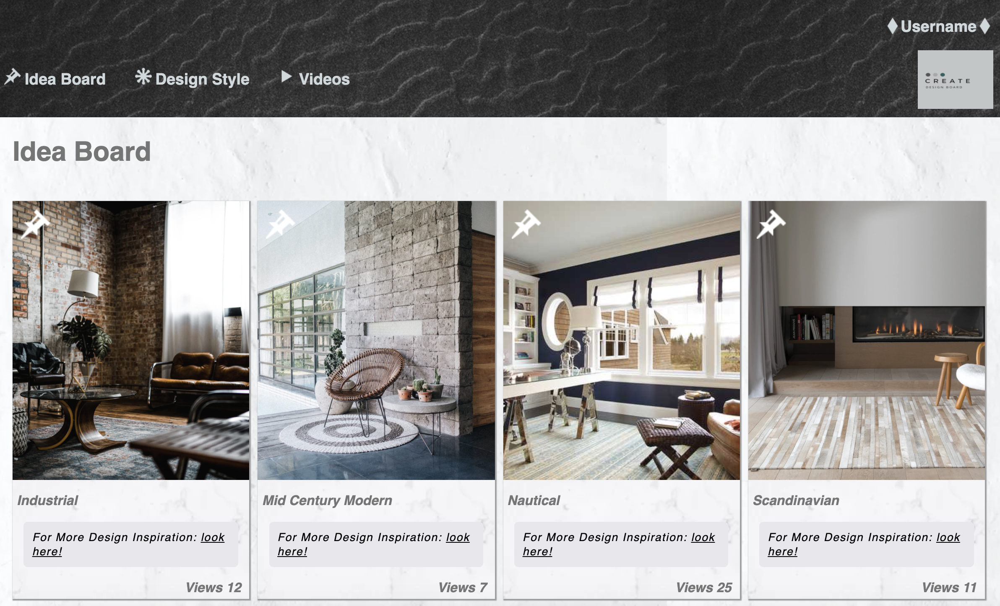

# ks-comp-challenge-1

**Contributors**

Katy St Sauveur

**Project Description**

This was a solo project that was designed to create a website of your own based loosely around a provided static comp. You could not deviate from the layout of the comp, but could use creative license to make the website design your own.  The requirements dictated that you make your page responsive and use media queries and breakpoints to achieve different layouts.  

**Project Goals**

* Create a responsive website using HTML and CSS.
* Use media queries and breakpoints in order to make the site responsive across screens of differing sizes.
* Attempt to have clean HTML and CSS code and refactor whenever possible with a goal of readability.
* Continue to work with GitHub and the git workflow process.

**Challenges**

* Creating a completely responsive site for multiple screens can be difficult.
* Using grid and flex-box to get your ideal layout.
* Making overlay images responsive was a challenge.

**Wins**

* Using HTML and CSS only to create a creative website with a strict deadline.
* Utilizing colors and textures that created a strong webpage.
* Working with Grid and Flex-box to create a responsive webpage that adapts to many different screen sizes.

**Programming Languages Used**

HTML
CSS

**Other Important Features Implemented**

Implementing overlay icons.
Using box shadow to add to a multi dimensional website.

## Finished Project

**Full Screen View**

**iPad View**

**iPhone View**

## Comp Given

